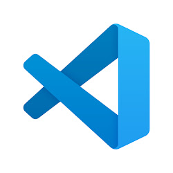

# Remote Access Tutorial
## What You Need
For this project, you will only need 1 program. This program is often talked about and assuming that you are Computer Science student,
you probably know which program I am talking about. The program is called VS Code. channels4_profile.jpeg. 				
## How to Install VS Code
Installing VS Code is not compicated at all. You just need to know your operating system (Windows, Mac, or Linux).
First, click on this link [Link](https://code.visualstudio.com/).
This link will take you to the official VS Code webiste where it gives you the option to download the program to your computer. Choose the corect operating
system and download. Extract the .zip file and congratulations, you now have VS Code. Easy peasy lemon squeezy.
You should now have a display like this:

Yours might look a bit different but it shouldn't be a problem.
## Interacting With the Terminal 
Alright, now that we have VS Code, we can access the terminal. To do so, go to the top and click onn terminal. A drop down should appear, click on 
new terminal.

Great! Now you have your terminal open. You will now type in your cs15l ssh account. In my case, it is this one: ssh cs15lsp23dr@ieng6.ucsd.edu
Everything should be the same except for the "dr". You should have your own two letters. Ater typing that command, it will ask for your password that
you made for the cs15lsp23 account. Note that when you are typing your password, the characters will not show and that is normal. After you input your password, you should see this prompt on your terminal. 

## Running Comands
Running commands is pretty simple. Copy and paste some of the commands to get the information you wish to recieve. 
Here is a list of commands:
* `cd ~`
* `cd'`
* `ls -lat`
* `ls -a`
* `ls <directory>`
* `cp /home/linux/ieng6/cs15lsp23/public/hello.txt ~/`
* `cat /home/linux/ieng6/cs15lsp23/public/hello.txt`
Here is an example of me running `ls -lat`:

## How to Exit
To exit, simply hold ctrl and press d. The terminal will output `Connection to ieng6.ucsd.edu closed.`
## Conclusion
ssh is very simple to do. All you need is VSCode to have a terminal open, copy and paste some commands, and boom, you have the information you ask for. 
Congratulations and havd fun using ssh! 
