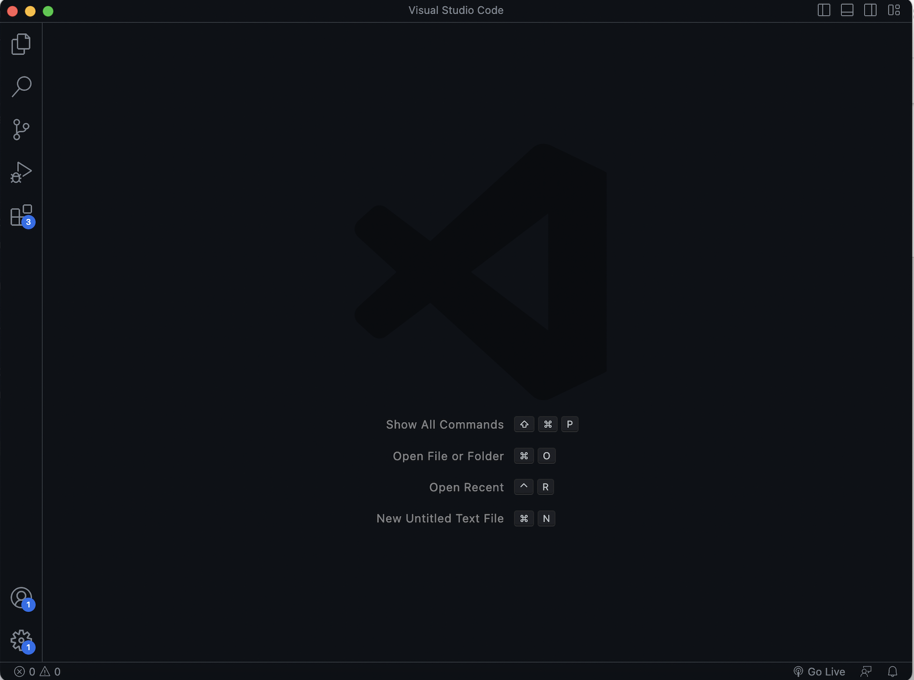

# Remote Access Tutorial
## What You Need
For this project, you will only need 1 program. This program is often talked about and assuming that you are Computer Science student,
you probably know which program I am talking about. The program is called VS Code. channels4_profile.jpeg. 				
## How to Install VS Code
Installing VS Code is not compicated at all. You just need to know your operating system (Windows, Mac, or Linux).
First, click on this link [Link](https://code.visualstudio.com/).
This link will take you to the official VS Code webiste where it gives you the option to download the program to your computer. Choose the corect operating
system and download. Extract the .zip file and congratulations, you now have VS Code. Easy peasy lemon squeezy.
You should now have a display like this:

Yours might look a bit different but it shouldn't be a problem.
## Interacting With the Terminal 
Alright, now that we have VS Code, we can access the terminal. To do so, 
